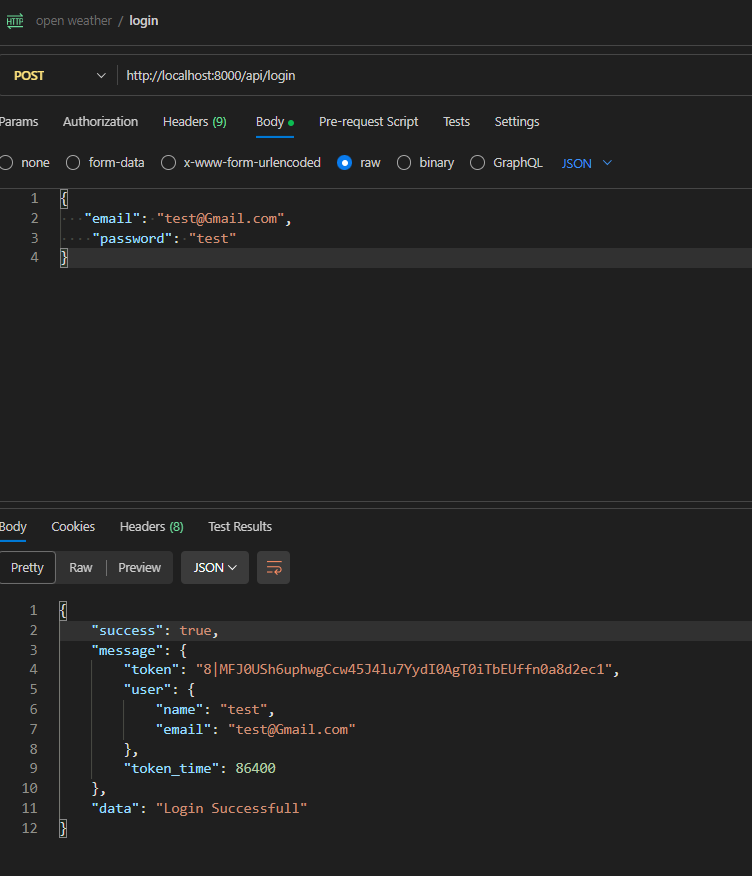

## Screenshots 

  
  

## STEPS FOR USE SANCTUM
<pre>
    LARAVEL SANCTUM TOKEN
Step 1: php artisan install:api
Step 2: composer require laravel/sanctum
Step 3: php artisan vendor:publish --provider="Laravel\Sanctum\SanctumServiceProvider"
Step 4: php artisan migrate
Step 5: if(At this moment if you want to store your user data in custom table then you have to modify your model and config>auth.php)
Step 5.1=>modify in config>auth.php
 'guards' => [
						 'guards' => [
    							    'web' => [
      								    'driver' => 'session',
           								    'provider' => 'users',
     								   ],
    						    'api' => [
          							  'driver' => 'sanctum',
          							  'provider' => 'users',
       							 ],
 						   ],
			  'providers' => [
        			       'users' => [
          			                'driver' => 'eloquent',
          				  'model' => 'custom_model',
 				],
  			        ],
Step 5.2 =>modify custom_model
 Add=>use Illuminate\Foundation\Auth\User as Authenticatable;
			Use =>HasApiTokens
			Add=> protected $hidden =[
      							  'password','remember_token',
            ];
else{ No need this changes it work default.}
Step 6 : Bootstrap>app.php for exception
 ->withExceptions(function (Exceptions $exceptions) {
        $exceptions->render(function (AuthenticationException $exceptions) {
            $returnData = [
                'message' => 'User is not authenticated!',
                'error' => $exceptions->getMessage()
            ];

            if (true) {
                $returnData['debug'] = $exceptions->getMessage();
            }

            return response()->json($returnData, 401);
        });
    })->create();
It will Handle the exception if you use wrong auth token it show error .
Step 7. NOW you can create controller and use registration and login

    Route::POST('register',[AutController::class,'register']);
REGISTER()
 public function register(Request $request){
        $validator = Validator::make($request->all(),[
            'name' => 'required',
            'email' => 'required|email|unique:user_details',
            'password' => 'required'

        ]);
        if($validator->fails()){
            return $this->SendError('validation Error Occur',$validator->errors()->all());
        }
        else{
            $user = new userDetails();
            $user->name =$request->name;
            $user->email =$request->email;
            $user->password =Hash::make($request->password);
            $user->save();
            return $this->SendResponse('User Created Successfully.',$user);}}

LOGIN()

Route::POST('login',[AuthController::class,'login'])->name('login');

<pre>
     public function login(Request $request){
        $validator = Validator::make(request()->all(), [
            'email' => 'required' ,
            'password' => 'required',
            
        ]);
        if ($validator->fails()) {
            return response()->json([$validator->errors()->all()]);
        }
        $userExist = User::where('email',$request->email)->first();
        if(!$userExist){
            return response()->json(['message' => 'User not found']);
        }
        else if(Auth::attempt(['email' => $userExist->email,'password'=>$request->password])){
            $Authuser =Auth::user()->email;
            $expire_in = 60*60*60;
            $token =$userExist->createToken('MyApp',['expire_in'=>$expire_in])->plainTextToken;
            $success['token']=$token;
            $success['User']=$Authuser;
            $success['expire_in']=$expire_in;
            return response()->json(['message' => 'User logged in successfully',$success]);
        }
    }
</pre>

## About Laravel

Laravel is a web application framework with expressive, elegant syntax. We believe development must be an enjoyable and creative experience to be truly fulfilling. Laravel takes the pain out of development by easing common tasks used in many web projects, such as:

- [Simple, fast routing engine](https://laravel.com/docs/routing).
- [Powerful dependency injection container](https://laravel.com/docs/container).
- Multiple back-ends for [session](https://laravel.com/docs/session) and [cache](https://laravel.com/docs/cache) storage.
- Expressive, intuitive [database ORM](https://laravel.com/docs/eloquent).
- Database agnostic [schema migrations](https://laravel.com/docs/migrations).
- [Robust background job processing](https://laravel.com/docs/queues).
- [Real-time event broadcasting](https://laravel.com/docs/broadcasting).

Laravel is accessible, powerful, and provides tools required for large, robust applications.

## Learning Laravel

Laravel has the most extensive and thorough [documentation](https://laravel.com/docs) and video tutorial library of all modern web application frameworks, making it a breeze to get started with the framework.

You may also try the [Laravel Bootcamp](https://bootcamp.laravel.com), where you will be guided through building a modern Laravel application from scratch.

If you don't feel like reading, [Laracasts](https://laracasts.com) can help. Laracasts contains thousands of video tutorials on a range of topics including Laravel, modern PHP, unit testing, and JavaScript. Boost your skills by digging into our comprehensive video library.

## Laravel Sponsors

We would like to extend our thanks to the following sponsors for funding Laravel development. If you are interested in becoming a sponsor, please visit the [Laravel Partners program](https://partners.laravel.com).

### Premium Partners

- **[Vehikl](https://vehikl.com/)**
- **[Tighten Co.](https://tighten.co)**
- **[WebReinvent](https://webreinvent.com/)**
- **[Kirschbaum Development Group](https://kirschbaumdevelopment.com)**
- **[64 Robots](https://64robots.com)**
- **[Curotec](https://www.curotec.com/services/technologies/laravel/)**
- **[Cyber-Duck](https://cyber-duck.co.uk)**
- **[DevSquad](https://devsquad.com/hire-laravel-developers)**
- **[Jump24](https://jump24.co.uk)**
- **[Redberry](https://redberry.international/laravel/)**
- **[Active Logic](https://activelogic.com)**
- **[byte5](https://byte5.de)**
- **[OP.GG](https://op.gg)**

## Contributing

Thank you for considering contributing to the Laravel framework! The contribution guide can be found in the [Laravel documentation](https://laravel.com/docs/contributions).

## Code of Conduct

In order to ensure that the Laravel community is welcoming to all, please review and abide by the [Code of Conduct](https://laravel.com/docs/contributions#code-of-conduct).

## Security Vulnerabilities

If you discover a security vulnerability within Laravel, please send an e-mail to Taylor Otwell via [taylor@laravel.com](mailto:taylor@laravel.com). All security vulnerabilities will be promptly addressed.

## License

The Laravel framework is open-sourced software licensed under the [MIT license](https://opensource.org/licenses/MIT).
